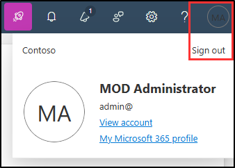

---
lab:
  task: Prepare your environment for administration
  exercise: Exercise 0 - Prepare your environment for administration
  title: 管理のために環境を準備する
  description: 監査を有効にし、コンプライアンス ロールを割り当て、Microsoft Purview ポータルを調べて、管理タスク用に環境を準備します。
  duration: 45 minutes
  level: 100
  islab: true
---

## WWL テナント - 使用条件

講師が指導するトレーニング配信の一環としてテナントを提供されている場合は、講師が指導するトレーニングでハンズオンラボをサポートする目的でテナントを利用できることに注意してください。

テナントを共有したり、ハンズオンラボ以外の目的で使用したりしないでください。 このコースで使われるテナントは試用版テナントであり、クラスが終了し、拡張機能の対象となっていない場合は、使用したりアクセスしたりすることはできません。

テナントを有料サブスクリプションに変換することはできません。 このコースの一環として取得したテナントは Microsoft Corporation の財産のままであり、当社はいつでもアクセス権とリポジトリを取得する権利を留保します。

# ラボ セットアップ: 管理のための環境の準備

このラボでは、管理タスク用に環境を構成して準備します。 必要な機能をアクティブ化し、管理アクセス許可を設定し、主要な要素を適切に構成します。

**タスク**:

- Microsoft Purview ポータルで監査を有効にする
- 演習 1 - コンプライアンス ロールを割り当てる
- Microsoft Purview ポータルについて調べる

## タスク 1 - Microsoft Purview ポータルで監査を有効にする

このタスクでは、Microsoft Purview ポータルで監査を有効にして、ポータル アクティビティを監視します。

1. **管理者**アカウントを使用して Client 1 VM (SC-401-CL1) にログインします。

1. Microsoft Edge を開き、**Microsoft Purview** ポータル (`https://purview.microsoft.com`) に移動します。

1. **MOD 管理者**としてサインインします。  
   - ユーザー名: `admin@WWLxZZZZZZ.onmicrosoft.com` (この場合の ZZZZZZ は、ラボ ホスティング プロバイダーから提供された一意のテナント プレフィックスです)  
   - パスワード: ラボ ホスティング プロバイダーから提供

1. 新しい Microsoft Purview ポータルに関するメッセージが画面に表示されます。 **[はじめに]** を選択して、新しいポータルにアクセスします。

    ![[ようこそ新しい Microsoft Purview ポータルへ] 画面のスクリーンショット。](../Media/welcome-purview-portal.png)

1. 左側のサイド バーから **[ソリューション]** を選択し、**[監査]** を選択します。

1. **[検索]** ページで、**[ユーザーと管理者のアクティビティの記録を開始する]** ボタンを選択して監査ログを有効にします。

    ![[ユーザーと管理者のアクティビティの記録を開始する] ボタンを示すスクリーンショット。](../Media/enable-audit-button.png)

1. このオプションを選択すると、このページに青いバーが表示されなくなるはずです。

    > **注:[監査] ボタンでログが有効にならない場合**
    >
    >一部のテナントでは、**[ユーザーと管理者のアクティビティの記録を開始する]** を選択しても監査が有効にならないことがあります。  
    >
    >このような場合は、代わりに PowerShell を使用して監査を有効にすることができます。
    >
    >1. Windows ボタンを右クリックし、**[ターミナル (管理者)]** を選択して、管理者特権のターミナル ウィンドウを開きます。  
    >
    >1. 最新の **Exchange Online PowerShell** モジュールをインストールします。
    >
    >     ```powershell
    >     Install-Module ExchangeOnlineManagement
    >     ```
    >
    >     すべてのプロンプトに対して「**Y**」(Yes を示します) と入力し、**Enter** キーを押します。
    >
    >1. 次のコマンドを実行して、実行ポリシーを変更します。
    >
    >     ```powershell
    >     Set-ExecutionPolicy -ExecutionPolicy RemoteSigned -Scope CurrentUser
    >     ```
    >
    >1. 管理者特権のターミナル ウィンドウを閉じて、通常の PowerShell セッションを開きます。
    >
    >1. Exchange Online に接続します。
    >
    >     ```powershell
    >     Connect-ExchangeOnline
    >     ```
    >
    >    `admin@WWLxZZZZZZ.onmicrosoft.com` としてサインインします (この ZZZZZZ は、ラボ ホスティング プロバイダーから提供された自分専用のテナント プレフィックスです)。 管理者のパスワードは、ラボ ホスティング プロバイダーから支給されます。
    >
    >1. [監査] が有効になっているかどうかを確認します。
    >
    >     ```powershell
    >     Get-AdminAuditLogConfig | FL UnifiedAuditLogIngestionEnabled
    >     ```
    >
    >    **_False_** が返された場合は、[監査] を有効にします。
    >
    >     ```powershell
    >     Set-AdminAuditLogConfig -UnifiedAuditLogIngestionEnabled $true
    >     ```
    >
    >1. 有効になっていることを確認します。
    >
    >     ```powershell
    >     Get-AdminAuditLogConfig | FL UnifiedAuditLogIngestionEnabled
    >     ```
    >
    >    [監査] が有効になると、このコマンドにより **_True_** が返されます。

Microsoft 365 で監査を正常に有効にしました。

## タスク 2 - コンプライアンス ロールを割り当てる

このタスクでは、これらのラボ演習で使用するユーザーに**コンプライアンス管理者**ロールを割り当てます。

1. **Microsoft Edge** を開き、**Microsoft 365 管理センター** (`https://admin.microsoft.com`) に移動します。 **全体管理者**権限を持つユーザーとしてログインする必要があります。

   > **注:** 多要素認証 (MFA) を設定するように要求されたら、利用可能な認証方法を使用してセットアップを完了し、ラボを続行します。

1. 左側のナビゲーション メニューで **[ユーザー]** を展開し、**[アクティブ ユーザー]** を選択します。

1. これらのラボ演習を続行するには、ユーザーを選択または作成します。

   既存のユーザーを使用する場合は、最小限のアクセス特権に基づき、権限が最小限のユーザーを選択します。

1. 新しいユーザーを作成する場合:

   1. **[アクティブ ユーザー]** ページで、**[+ ユーザーの追加]** を選択します。

   1. **[基本情報の設定]** ページで、必要なユーザーの詳細を入力し、**[次へ]** を選択します。

   1. **[製品ライセンスの割り当て]** ページで、場所を選択し、利用可能な場合はライセンス (Microsoft 365 E5 ライセンスまたは互換アドオン) を割り当てます。  
   ライセンスが利用できない場合は、**[製品ライセンスなしでユーザーを作成]** をオンにし、**[次へ]** を選択します。

   1. **[オプションの設定]** ページで、**[役割]** を展開し、**[管理者センターへのアクセス]** をオンにします。

   1. **[カテゴリ別にすべてを表示]** を展開します。

   1. **[セキュリティとコンプライアンス]** で、**[コンプライアンス管理者]** を選択します。

   1. [**次へ**] を選択します。

   1. **[確認と完了]** ページで設定を確認し、**[追加の完了]** を選択してユーザーの作成を完了します。

1. 既存のユーザーを変更する場合:

   1. ユーザーを選択し、**[ロールの管理]** を選択します。

   1. **[管理者ロールの管理]** ページで、**[管理センターへのアクセス]** を選択します。

   1. **[カテゴリ別にすべてを表示]** を展開します。

   1. **[セキュリティとコンプライアンス]** で、**[コンプライアンス管理者]** を選択します。

   1. **[変更の保存]** を選択します。

1. 右上隅のユーザー アイコンを選択し、**[サインアウト]** を選択して、全体管理者のアクセス権を持つアカウントからサインアウトします。

   例:

   

このラボの様々な演習の実施が求められているユーザーに、**コンプライアンス管理者**ロールが正常に割り当てられました。

## タスク 3 – Microsoft Purview ポータルについて調べる

このタスクでは、Microsoft Purview ポータルを探索するために、以前に**コンプライアンス管理者**ロールを付与したユーザーとしてサインインします。 このロールは、次のラボと演習で**コンプライアンス管理者**と呼ばれます。

1. **Microsoft Edge** で **Microsoft Purview** ポータル (**`https://purview.microsoft.com`**) に移動します。

1. **[アカウントを選択]** ウィンドウが表示されたら、**[別のアカウントを使用]** を選択します。

1. **[サインイン]** ウィンドウが表示されたら、以前に**コンプライアンス管理者**として選択したユーザーとしてサインインします。

1. 新しい Microsoft Purview ポータルについて理解します。 終了したら、ブラウザーの画面を開いたままにしておきます。

**コンプライアンス管理者**のアカウントへの切り替えが正常に完了し、ラボを開始する準備ができました。
