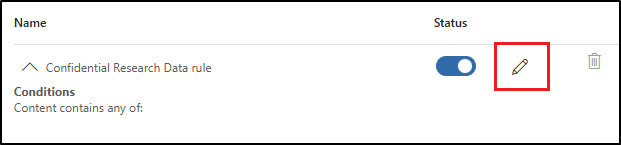

---
lab:
  task: Create and publish a sensitivity label
  exercise: Exercise 2 - Create and publish a sensitivity label
---

# スキル タスク

あなたの仕事は、機密性のレベルと必要なアクセス制御に従って機密データを分類して保護する秘密度ラベルを組織内で作成し、公開することです。

**タスク**:

1. 秘密度ラベルのサポートを有効にする  
1. ラベル グループを作成する  
1. 子ラベルを作成する  
1. ラベルを発行する  
1. 自動ラベル付けを構成する  

## タスク 1 - SharePoint と OneDrive での秘密度ラベルのサポートを有効にする

このタスクでは、秘密度ラベルの共同編集を有効にします。これにより、SharePoint と OneDrive のファイルの秘密度ラベルも有効になります。

1. **Microsoft Edge** を開き、`https://purview.microsoft.com` に移動します。

1. 左側のナビゲーションで、**[設定]** > **[Microsoft Information Protection]** を選択します。

1. **[Microsoft Information Protection] の設定**で、**[秘密度ラベルが付いたファイルの共同編集]** タブが表示されていることを確認します。

1. **[秘密度ラベルのあるファイルの共同編集を有効にする]** チェック ボックスをオンにします。

1. 画面の下部にある **[適用]** を選択します。

これで、SharePoint および OneDrive での秘密度ラベルのサポートが有効になりました。

<!--

## Task 2 – Create sensitivity labels

In this task, your HR department has requested a sensitivity label to apply to HR employee documents. You'll create a sensitivity label for internal documents and a sublabel for the HR department.

1. Open **Microsoft Edge** and navigate to **`https://purview.microsoft.com`**. Log into Microsoft Purview as the user you selected as the **Compliance Administrator**.

1. In the Microsoft Purview portal, select **Solutions** from the left sidebar, then select **Information Protection**.

1. On the **Microsoft Information Protection** page, on the left sidebar, select **Sensitivity labels**.

1. On the **Sensitivity labels** page select **+ Create a label**.

1. The **New sensitivity label** configuration will start. On the **Provide basic details for this label**, enter:

    - **Name**: `Internal`
    - **Display name**: `Internal`
    - **Description for users**: `Internal sensitivity label.`
    - **Description for admins**: `Internal sensitivity label for Contoso.`

1. Select **Next**.

1. On the **Define the scope for this label** page, select **Items**, then select **Files** and **Emails**. If the checkbox for **Meetings** is selected, make sure it's deselected.

   > [!NOTE]
   > When **Meetings** is selected, you can't create a sublabel for the sensitivity label.

1. Select **Next**.

1. On the **Choose protection settings for labeled items** page, select **Next**.

1. On the **Auto-labeling for files and emails** page, select **Next**.

1. On the **Define protection settings for groups and sites** page, select **Next**.

1. On the **Auto-labeling for schematized data assets (preview)** page, select **Next**.

1. On the **Review your settings and finish** page, select **Create label**.

1. On the **Your sensitivity label was created** page, select **Don't create a policy yet**, then select **Done**.

1. On the **Sensitivity labels** page, find the newly created **Internal** sensitivity label. Select the vertical ellipsis (**...**) next to it, then select **+ Create sublabel** from the dropdown menu.

    

1. The **New sensitivity label** wizard will start. On the **Provide basic details for this label** page enter:

   - **Name**: `Employee data (HR)`
   - **Display name**: `Employee data (HR)`
   - **Description for users**: `This HR label is the default label for all specified documents in the HR Department.`
   - **Description for admins**: `This label was created with input from the Head of HR. Contact the HR department for any changes to the label settings.`

1. Select **Next**.

1. On the **Define the scope for this label** page, select **Items**, then select **Files**, **Emails**, and **Meetings**.

1. Select **Next**.

1. On the **Choose protection settings for labeled items** page, select the **Control access** option, then select **Next**.

1. On the **Access control** page, select **Configure access control settings**.

1. Configure the encryption settings with these options:

   - **Assign permissions now or let users decide?**: Assign permissions now
   - **User access to content expires**: Never
   - **Allow offline access**: Only for a number of days
   - **Users have offline access to the content for this many days**: 15
   - Select the **Assign permissions** link. On the **Assign permissions** flyout panel, select the **+ Add any authenticated users**, then select **Save** to apply this setting.

1. On the **Access control** page, select **Next**.

1. On the **Auto-labeling for files and emails** page, select **Next**.

1. On the **Define protection settings for groups and sites** page, select **Next**.

1. On the **Auto-labeling for schematized data assets (preview)** page, select **Next**.

1. On the **Review your settings and finish** page, select **Create label**.

1. On the **Your sensitivity label was created** page, select **Don't create a policy yet**, then select **Done**.

You have successfully created a sensitivity label for your organizations internal policies and a sensitivity sublabel for the Human Resources (HR) department.

## Task 3 – Publish sensitivity labels

You will now publish the Internal and HR sensitivity label so that the published sensitivity labels will be available for the HR users to apply to their HR documents.

1. In **Microsoft Edge**, the Microsoft Purview portal tab should still be open. If not, navigate to **`https://purview.microsoft.com`** > **Solutions** > **Information Protection** > **Sensitivity labels**.

1. On the **Sensitivity labels** page select **Publish labels**.

1. The publish sensitivity labels configuration will start.

1. On the **Choose sensitivity labels to publish** page, select the **Choose sensitivity labels to publish** link.

1. On the **Sensitivity labels to publish** flyout panel, select the **Internal** and **Internal/Employee Data (HR)** checkboxes, then select **Add** at the bottom of the flyout panel.

1. Back on the **Choose sensitivity labels to publish** page, select **Next**.

1. On the **Assign admin units** page, select **Next**

1. On the **Publish to users and groups** page, select **Next**.

1. On the **Policy settings** page, select **Next**.

1. On the **Default settings for documents** page, select **Next**.

1. On the **Default settings for emails** page, select **Next**.

1. On the **Default settings for meetings and calendar events** page, select **Next**.

1. On the **Default settings for Fabric and Power BI content** page, select **Next**.

1. On the **Name your policy** page, enter:

   - **Name**: `Internal HR employee data`
   - **Enter a description for your sensitivity label policy**: `This HR label is to be applied to internal HR employee data.`

1. Select **Next**.

1. On the **Review and finish** page, select **Submit**.

1. On the **New policy created**, select **Done** to finish publishing your label policy.

You have successfully published the Internal and HR sensitivity labels. Note that it can take up to 24 hours for changes to replicate to all users and services.

## Task 4 – Create a client-side auto labeling policy

In this task, you'll create a client-side auto-labeling policy. Client-side auto-labels apply automatically to files and emails based on their content, ensuring that sensitive information is classified and protected before it leaves the user's device.

1. You should still be on the **Sensitivity labels** page in the Microsoft Purview portal. If not, navigate to **`https://purview.microsoft.com`** > **Solutions** > **Information Protection** > **Sensitivity labels**.

1. On the **Sensitivity labels** page, find the newly created **Internal** sensitivity label. Select the vertical ellipsis (**...**) next to it, then select **+ Create sublabel** from the dropdown menu.

1. The **New sensitivity label** configuration will start. On the **Provide basic details for this label** page, enter:

   - **Name**: `Confidential Research Data`
   - **Display name**: `Confidential Research Data`
   - **Description for users**: `This document or email contains sensitive research or development data that is proprietary to the organization.`
   - **Description for admins**: `This label is auto-applied to documents and emails containing information related to research, prototypes, or internal projects.`

1. Select **Next**.

1. On the **Define the scope for this label** page, select **Items**, then select **Files**, **Emails**, and **Meetings**.

1. Select **Next**.

1. On the **Choose protection settings for labeled items** page, select **Apply content marking**, then select **Next**.

1. Select **Next**.

1. On the **Content marking** page, select the toggle to enable content marking.

1. If the checkbox for **Add a footer** is selected, deselect it, and select the checkbox for **Add a watermark**, then select **Customize text**.

1. In the **Customize watermark text** flyout pane, enter `Confidential - R&D Data` as **Watermark text**. Increase the **Font size** to `40`, then select **Save** at the bottom of the panel.

1. Back on the **Content marking** page, if other content marking options are enabled, disable them to ensure **Add a watermark** is the only option enabled.

1. Select **Next**.

1. On the **Auto-labeling for files and emails** page, set the **Auto-labeling for files and emails** to enabled.

1. In the **Detect content that matches these conditions** section, select **+ Add condition** > **Content contains**.

1. In **Content contains** section select the **Add** > **Trainable classifiers**.

1. In the **Trainable classifiers** flyout panel, add these trainable classifiers:

   - `Source code`
   - `Project documents`
   - `Software Product Development Files`

1. Select **Add** at the bottom of the panel to add these trainable classifiers.

1. Back on the **Auto-labeling for files and emails** page, select **Next**.

1. On the **Define protection settings for groups and sites** page, select **Next**.

1. On the **Auto-labeling for schematized data assets (preview)** page, select **Next**.

1. On the **Review your settings and finish** page, select **Create label**.

1. On the **Your sensitivity label was created** page, select **Publish label to users' apps**, then select **Done**.

1. On the **Publish label** flyout panel, select **Create new label policy**.

1. On the **Choose sensitivity labels to publish** page, select the **Choose sensitivity labels to publish** link.

1. Select the parent **Internal** label and the **Confidential Research Data** label that was just created, then select **Add**.

1. Back on the **Choose sensitivity labels to publish** page, select **Next**.

1. On the **Assign admin units** page, select **Next**.

1. On the **Publish to users and groups** page, select **Next**.

1. On the **Policy settings** page, select the checkbox for **Users must provide a justification to remove a label or lower its classification**, then select **Next**.

1. On the **Default settings for documents** page, select **Next** until you reach the **Name your policy** page.

1. On the **Name your policy** page, enter:

   - **Name**: `R&D Confidential Data Policy`
   - **Enter a description for your sensitivity label policy**: `Automatically applies labels to source code, project documents, and development files to protect sensitive R&D data.`

1. Select **Next**.

1. On the **Review and finish** page, select **Submit**.

1. On the **New policy created** page, select **Done**.

You have successfully created a client-side auto-labeling policy that will automatically apply the **Confidential Research Data** label to files and emails containing research and development data. It might take up to 24 hours for the policy to take full effect.

## Task 5 – Create a service-side auto labeling policy

In this task, you'll create a service-side auto-labeling policy. Service-side auto-labels are applied by cloud services like SharePoint, Exchange, and OneDrive after content is uploaded or received, ensuring that sensitive data is protected even if users don't manually classify it.

1. You should still be on the **Sensitivity labels** page in the Microsoft Purview portal. If not, navigate to **`https://purview.microsoft.com`** > **Solutions** > **Information Protection** > **Sensitivity labels**.

1. Expand the **Internal** label, then select the `Confidential Research Data` sublabel you created in a previous task.

1. In the **Confidential Research Data** flyout panel, you'll see the properties for the auto-label you created in a previous task. In this panel, select **Create auto-labeling policy**.

    

1. On the **Name your policy** page, enter:

   - **Name**: `R&D Confidential Data Container Policy`
   - **Enter a description for your sensitivity label policy**: `Automatically applies the Confidential Research Data label to content in SharePoint, Exchange, and OneDrive.`

1. Select **Next**.

1. On the **Assign admin units** page, select **Next**.

1. On the **Choose locations where you want to apply the label** page, leave **Exchange email**, **SharePoint sites**, and **OneDrive accounts** selected, then select **Next**.

1. On the **Set up common or advanced rules** page, leave **Common rules** selected, then select **Next**.

1. On the **Define rules for content in all locations** page, edit the **Confidential Research Data rule**.

    

1. In the **New rule** flyout panel, under **Conditions** > **Content contains** select the dropdown for **Add**, then select **Trainable classifiers**.

1. In the **Trainable classifiers** flyout panel, add these trainable classifiers:

   - `Source code`
   - `Project documents`
   - `Software Product Development Files`

   This ensures consistent protection between client-side and service-side labels.

1. Select **Add** at the bottom of the panel to add these trainable classifiers.

1. Back on the **Define rules for content in all locations** page, select **Next**.

1. On the **Choose a label to auto-apply**, leave the **Internal/Confidential Research Data** chosen, then select **Next**.

1. On the **Decide if you want to test out the policy now or later** page, select **Run policy in simulation mode**, and select the checkbox for **Automatically turn on policy if not modified after 7 days in simulation**, then select **Next**.

1. On the **Review and finish** page, select **Create policy**.

1. On the **Your auto-labeling policy was created** page, select **Done**.

You have successfully created a service-side auto-labeling policy that will automatically apply the **Confidential Research Data** label to content stored or shared in SharePoint, Exchange, and OneDrive. It might take up to 24 hours for the policy to take effect.

-->
## タスク 2 – ラベル グループを作成する

このタスクでは、内部秘密度ラベルを整理するためのラベル グループを作成します。 ラベル グループは、部署や事業単位の分類など、関連するラベルのコンテナーとして機能します。

1. 引き続きコンプライアンス管理者として Microsoft Purview ポータルにサインインしている必要があります。

1. **Microsoft Edge** で、 `https://purview.microsoft.com` に移動します。

1. Microsoft Purview ポータルの左サイドバーで、**[ソリューション]** を選択してから、**[Microsoft Information Protection]** を選択します。

1. **[Microsoft Information Protection]** ページの左サイドバーで、**[秘密度ラベル]** を選択します。

1. **[秘密度ラベル]** ページで、**[+ 作成]**  >  **[ラベル グループ]** の順に選択します。

1. **[新しいラベル グループ]** の構成が開始されます。 **[このラベル グループの基本的な詳細を指定します]** で、次のように入力します。

    - **名前**: `Internal`
    - **表示名**: `Internal`
    - **ユーザー向けの説明**: `Internal sensitivity label.`
    - **管理者向けの説明**: `Internal sensitivity label group for Contoso.`

1. [**次へ**] を選択します。

1. **[設定を確認して完了]** ページで、**[ラベル グループの作成]** を選択します。

1. **[ラベル グループが正常に作成されました]** ページで、**[ラベルをまだ作成しない]** を選択し、**[完了]** を選択します。

内部用のラベル グループを作成しました。 このグループは、特定の部署またはデータ カテゴリの関連ラベルを管理するのに役立ちます。

## タスク 3 – 子ラベルを作成する

ラベル グループを作成したので、人事関連コンテンツ用の子ラベルを追加します。 このラベルは、暗号化とコンテンツ マーキングを適用して、承認されていないアクセスから人事データを保護します。

1. **[秘密度ラベル]** ページで、**[内部]** 秘密度ラベル グループを見つけます。 その横にある垂直の省略記号 (**[...]**) を選択し、ドロップダウン メニューから **[+ グループにラベルを作成する]** を選択します。

    ![秘密度ラベルのグループにラベルを作成するための [アクション] メニューを示すスクリーンショット。](../Media/create-label-in-group.png)

1. **[新しい秘密度ラベル]** ウィザードが起動します。 **[このラベルの基本的な詳細を指定します]** で、次のように入力します。

   - **名前**: `Employee data (HR)`
   - **表示名**: `Employee data (HR)`
   - **ユーザー向けの説明**: `This HR label is the default label for all specified documents in the HR Department.`
   - **管理者向けの説明**: `This label is created in consultation with Ms. Jones (Head of the HR department). Contact her if you need to change the label settings.`

1. [**次へ**] を選択します。

1. **[このラベルの範囲を定義する]** ページで、**[ファイルと他のデータ資産]**、**[メール]** の順に選択します。 **[会議]** のチェック ボックスがオンになっている場合は、選択が解除されていることを確認します。

1. [**次へ**] を選択します。

1. **[選択した項目の種類の保護設定を選択します]** ページで、**[アクセスの制御]**、**[コンテンツマーキングを適用する]** オプション、**[次へ]** の順に選択します。

1. **[アクセスの制御]** ページで **[アクセス制御設定の構成]** を選択します。

1. 次のオプションを使用して暗号化設定を構成します。

   - **アクセス許可を今すぐ割り当てますか、それともユーザーが決定するようにしますか?** :アクセス許可を今すぐ割り当てる
   - **コンテンツに対するユーザーのアクセス許可の期限**:許可しない
   - **オフライン アクセスを許可する**:数日のみ
   - **ユーザーがコンテンツへオフラインでアクセスできる日数**:15
   - **[アクセス許可の割り当て]** リンクを選択します。 **[アクセス許可の割り当て]** ポップアップ パネルで **[+ 認証されたユーザーの追加]** を選択し、**[保存]** を選択してこの設定を適用します。

1. **[アクセスの制御]** ページで、**[次へ]** を選択します。

1. **[コンテンツ マーキング]** ページで、トグルを選択して**コンテンツ マーキング**を有効にします。

1. 次のマーキング タイプごとに、チェック ボックスをオンにし、編集アイコンを選択してテキストを入力します。

   |マーキング タイプ|Text|
   |:---|:---|
   |透かしの追加|`INTERNAL USE ONLY`|
   |ヘッダーの追加|`Internal Document`|
   |フッターの追加|`Contoso Confidential`|

1. [**次へ**] を選択します。

1. **[ファイルとメールの自動ラベル付け]** ページで、**[次へ]** をクリックします。

1. **[グループとサイトの保護設定を定義]** ページで、**[次へ]** をクリックします。

1. **[設定を確認して完了]** ページで、**[ラベルを作成]** を選択します。

1. **[秘密度ラベルが作成されました]** ページ上で、**[ポリシーをまだ作成しない]** を選択し、**[完了]** を選択します。

"内部" ラベル グループ内に子ラベルを作成しました。 このラベルは、人事ドキュメントに暗号化とコンテンツのマーキングを適用して、機密データを簡単に識別し、ポリシーで保護できるようにします。

## タスク 4 – ラベルを発行する

次に、人事部門のユーザーがドキュメントにラベルを適用できるように、"内部" ラベル グループから人事ラベルを発行します。

1. 引き続きコンプライアンス管理者として Microsoft Purview ポータルにサインインしている必要があります。

1. **Microsoft Edge** で、Microsoft Purview ポータルのタブがまだ開かれているはずです。 そうでない場合は、**`https://purview.microsoft.com`** > **[ソリューション]** > **[Microsoft Information Protection]** > **[秘密度ラベル]** に移動します。

1. **[秘密度ラベル]** ページで **[ラベルを発行]** を選択します。

1. 秘密度ラベルの発行構成が起動します。

1. **[発行する秘密度ラベルを選ぶ]** ページで、**[発行する秘密度ラベルを選ぶ]** リンクを選択します。

1. **[発行する秘密度ラベル]** ポップアップ パネルで、**[内部/従業員データ (人事)]** チェックボックスをオンにし、ポップアップ ページの下部にある **[追加]** を選択します。

1. **[発行する秘密度ラベルを選ぶ]** ページに戻り、**[次へ]** を選択します。

1. [**管理単位を割り当てる**] ページで、[**次へ**] を選択します。

1. **[ユーザーとグループに発行]** ページで **[次へ]** を選択します。

1. **[ポリシー設定]** ページで **[次へ]** を選択します。

1. **[ドキュメントの既定の設定]** で、 **[次へ]** を選択します。

1. **[メールの既定の設定]** で、 **[次へ]** を選択します。

1. **[会議と予定表イベントの既定の設定]** で、 **[次へ]** を選択します。

1. **[Fabric および Power BI コンテンツの既定の設定]** ページで、**[次へ]** を選択します。

1. **[ポリシーの名前の設定] ページ**で、以下を入力します。

   - **名前**: `Internal HR employee data`

   - **秘密度ラベル ポリシーの説明を入力してください**: `This HR label is to be applied to internal HR employee data.`

1. [**次へ**] を選択します。

1. **[確認と完了]** ページで、**[送信]** を選択します。

1. **[新しいポリシーが作成されました]** ページで、 **[完了]** を選択して、ラベル ポリシーの発行を完了します。

"内部" ラベル グループとその人事ラベルを発行したので、ユーザーは、それを人事ドキュメントに適用できるようになりました。 ポリシーがサービス全体に伝達されるまでに最大 24 時間かかる場合があります。

## タスク 5 – 自動ラベル付けを構成する

次に、財務データの子ラベルを作成し、クレジット カードや銀行の支店番号などの財務識別子を含むコンテンツに自動的に適用されるように構成します。

1. 引き続きコンプライアンス管理者として Microsoft Purview ポータルにサインインしている必要があります。

1. **Microsoft Edge** で、`https://purview.microsoft.com` に移動し、コンプライアンス管理者として Microsoft Purview ポータルにログインします。

1. Microsoft Purview ポータルで、**[ソリューション]**  >  **[Information Protection]**  >  **[秘密度ラベル]** の順に選択します。

1. **[秘密度ラベル]** ページで、**Internal** 秘密度ラベルを見つけます。 垂直の省略記号 (**[...]**) を選択し、ドロップダウン メニューから **[+ グループにラベルを作成する]** を選択します。

1. **[このラベルの基本的な詳細を指定します]** で、次のように入力します。

   |詳細|Text|
   |---|---|
   |**名前**|`Financial Data`|
   |**表示名**|`Financial Data`|
   |**ユーザー向けの説明**|`This content contains financial data that must be labeled and protected.`|
   |**管理者向けの説明**|`This label is used for content that includes sensitive financial identifiers.`|

1. [**次へ**] を選択します。

1. **[このラベルの範囲を定義する]** ページで、**[ファイルと他のデータ資産]**、**[メール]** の順に選択します。 **[会議]** のチェック ボックスがオンになっている場合は、選択が解除されていることを確認します。

1. [**次へ**] を選択します。

1. **[選択した項目の種類の保護設定を選択します]** ページで、 **[次へ]** を選択します。

1. **[ファイルとメールの自動ラベル付け]** ページで、**[ファイルとメールの自動ラベル付け]** を有効に設定します。

1. **[これらの条件に一致するコンテンツを検出する]** セクションで、**[+条件の追加]** >  を選択し、**[コンテンツに含まれている]** を選択します。

1. **[コンテンツに含まれている]** セクションで、**[追加]**  >  **[機密情報の種類]** の順に選択します。

1. **[機密情報の種類]** ポップアップ ページで、次の機密情報の種類を検索して選択します。

   - `Credit Card Number`
   - `ABA Routing Number`
   - `SWIFT Code`

1. **[追加]** を選択します。

1. [**ファイルとメールの自動ラベル付け**] ページで、[**次へ**] をクリックします。

1. **[グループとサイトの保護設定を定義]** ページで、**[次へ]** をクリックします。

1. **[設定を確認して完了]** ページで、**[ラベルを作成]** を選択します。

1. **[秘密度ラベルが作成されました]** ページで、**[機密コンテンツにラベルを自動的に適用する]** を選択し、**[完了]** を選択します。

1. **[自動ラベル付けポリシーの作成]** ポップアップ ページで、**[ポリシーを確認する]** を選択します。

1. **[自動ラベル付けポリシーの名前]** ページで、既定値のままにして、**[次へ]** を選択します。

1. **[自動適用するラベルを選択する]** ページで、_Internal/Financial Data_ ラベルが表示されていることを確認し、**[次へ]** を選択します。

1. [**管理単位を割り当てる**] ページで、[**次へ**] を選択します。

1. **[ラベルを適用する場所の選択する]** ページで、次のオプションを選択します。

   - Exchange メール
   - SharePoint サイト
   - OneDrive アカウント

1. [**次へ**] を選択します。

1. **[共通ルールまたは詳細ルールを設定する]** ページで、デフォルトの **[共通ルール]** を選択したまま、**[次へ]** を選択します。

1. **[すべての場所のコンテンツのルールを定義する]** ページで、_[Financial Data 件のルール]_ を展開して期待されるルールが定義されていることを確認してから、**[次へ]** を選択します。

1. **[追加のメール設定]** ページで、**[次へ]** を選択します。

1. **[ポリシーを今すぐまたは後でテストするかを決定する]** ページで、**[シミュレーション モードでポリシーを実行する]** を選択し、**[シミュレーションで 7 日経過しても変更されていない場合は、ポリシーを自動的にオンにします]** のチェックボックスをオンにします。

1. [**次へ**] を選択します。

1. **[確認と完了]** ページで、**[ポリシーを作成]** を選択します。

1. **[自動ラベル付けポリシーが作成されました]** ページで、**[完了]** を選択します。

グループ内のラベルを整理し、それらをユーザーに公開し、自動ラベル付けを有効にしたので、機密コンテンツはユーザーに依存せずに保護されます。
